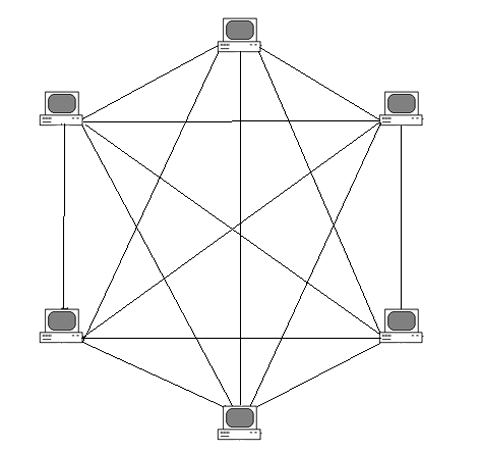
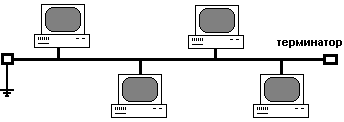
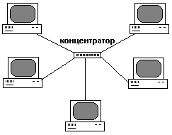
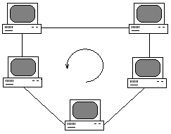
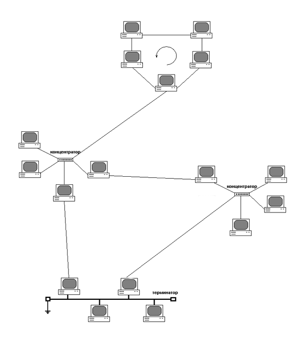

# Конспект к экзамену по предмету Сети ЭВМ

## 1. Концепция сетевой связи. Процесс передачи данных. Сетевые устройства

Концепция сетевой связи основывается на принципе передачи данных между различными компьютерными системами или
компонентами с использованием конкретной сетевой структуры.

Процесс передачи данных таков: данные преобразуются в подходящий для передачи формат, затем отправляются по каналу связи
от источника к приёмнику. Приёмник затем преобразует полученные данные обратно в исходный формат.

Сетевые устройства - это физические или виртуальные устройства, которые обрабатывают, пересылают или получают данные.

## 2. LAN, MAN и WAN. Типы топологий сети

### LAN, MAN и WAN

**LAN** (Local Area Network - локальная сеть) - это компьютерная сеть, покрывающая небольшую географическую зону
радиусом действия 1-5 км. LAN может покрывать здание или их группу.

**MAN** (Metropolitan Area Network - городская сеть) - это компьютерная сеть, часто используемая в городах и
покрывающая зону радиусом в 50-60 км. MAN можно рассматривать как группу LAN, соединённых общим мостом. MAN может
покрывать город.

**WAN** (Wide Area Network) - это компьютерная сеть, которая охватывает крупномасштабную географическую зону радиусом
50-500 км. WAN может покрывать страну, континент.

### Типы топологий сети

#### Полносвязная

Каждый компьютер непосредственно связан со всеми остальными. Данный вариант громоздкий и неэффективный, так как требует
для каждого компьютера большое количество коммуникационных портов, достаточное для связи с каждым из остальных
компьютеров

#### Шина

Представляет собой общий кабель, к которому подсоединены все компьютеры. На концах кабеля находятся терминаторы для
предотвращения отражения сигнала.

Преимущества:
* уменьшение расхода кабеля
* устойчивость сети к неисправностям отдельных узлов
* простота конфигурации и настройки

Недостатки:
* разрыв кабеля влияет на работу всей сети
* ограниченная длина кабеля и количество компьютеров в сети
* низкая производительность из-за разделения канала между всеми устройствами

#### Звезда

Каждое устройство подключается к хабу. Данные от передающей станции сети передаются через хаб по всем линиям связи всем
компьютерам.

Преимущества:
* простота подключения новых устройств
* возможность централизованного управления
* устойчивость сети к неисправности отдельных узлов

Недостатки:
* отказ хаба влияет на работу всей сети
* большой расход кабеля

#### Кольцо

Все узлы соединены каналами связи в неразрывное кольцо. Выход одного ПК соединяется со входом другого ПК. Данные в
кольце всегда движутся в одном и том же направлении.

Данную сеть очень легко создавать и настраивать, но повреждение линии связи в одном месте или отказ устройства приводит
к неработоспособности всей сети.

#### Ячеистая

Получается из полносвязной топологии путём удаления некоторых связей. Допускает соединение большого количества
компьютеров и характерна для крупных сетей.

#### Смешанная

Данная топология преобладает в крупных сетях и представляет собой произвольные связи между компьютерами. В таких сетях
можно выделить отдельные произвольно связанные фрагменты, имеющие типовую топологию, поэтому данная топология является
смешанной.

## 3. Протокол и интерфейс. Модель OSI и описание её уровней

### Протокол и интерфейс

**Протокол** - это формализованные правила, определяющие последовательность и формат сообщений, которыми обмениваются
сетевые компоненты, лежащие на одном уровне, но в разных узлах.

**Интерфейс** - это формализованные правила, определяющие последовательность и формат сообщений, которыми обмениваются
сетевые компоненты, лежащие на соседних уровнях в одном узле.

Протокол и интерфейс выражают одно и то же понятие, но относятся к разным областям действия: протоколы определяют
правила взаимодействия модулей одного уровня в разных узлах, а интерфейсы - модулей соседних уровней в одном узле.

### Модель OSI и описание её уровней

**Сетевая модель OSI** - это сетевая модель стека сетевых протоколов OSI/ISO. Посредством данной модели различные
сетевые устройства могут взаимодействовать друг с другом. Модель определяет различные уровни взаимодействия систем.
Каждый уровень выполняет определённые функции при таком взаимодействии.

Уровни модели OSI:

| Уровень       | Тип данных          | Функции                                                  | Примеры                                              | Оборудование                                  |
|---------------|---------------------|----------------------------------------------------------|------------------------------------------------------|-----------------------------------------------|
| Прикладной    | Данные              | Доступ к сетевым службам                                 | HTTP, FTP, POP3, SMTP, WebSocket                     | Хосты, межсетевой экран                       |
| Представления | Данные              | Представление и шифрование данных                        | ASCII, EBCDIC,SSL, gzip                              | Хосты, межсетевой экран                       |
| Сеансовый     | Данные              | Управление сеансом связи                                 | RPC, PAP, L2TP, gRPC                                 | Хосты, межсетевой экран                       |
| Транспортный  | Сегменты/датаграммы | Прямая связь между конечными пунктами и надёжность       | TCP, UDP, SCTP, порты                                | Хосты, межсетевой экран                       |
| Сетевой       | Пакеты              | Определение маршрута и логическая адресация              | IPv4, IPv6, IPsec, AppleTalk, ICMP                   | Маршрутизатор, сетевой шлюз, межсетевой экран |
| Канальный     | Биты/кадры          | Физическая адресация                                     | PPP, IEEE, 802.22, Ethernet, DSL, ARP, сетевая карта | Сетевой мост, коммутатор, точка доступа       |
| Физический    | Биты                | Работа со средой передачи, сигналами и двоичными данными | USB, RJ                                              | Концентратор, повторитель                     |

## 4. Модель TCP/IP и её протоколы

## 5. Обзор протоколов уровня приложений и транспортного уровня модели TCP/IP

## 6. Форматы заголовков протоколов TCP и UDP

### Заголовок UDP

Заголовок UDP включает следующее:
* порт отправителя (16 бит)
* порт получателя (16 бит)
* длина сообщения (16 бит)
* контрольная сумма (16 бит)
* данные (переменная длина)

### Заголовок TCP

Заголовок TCP включает следующее:
* порт отправителя (16 бит)
* порт получателя (16 бит)
* порядковый номер (32 бита) - порядковый номер первого октета данных сегмента, используемый для гарантии правильного
упорядочения приходящих данных
* номер подтверждения (32 бита) - следующий ожидаемый октет TCP
* длина заголовка (4 бита) - количество 32-битных слов в заголовке
* зарезервировано (3 бита)
* управляющие биты (9 бит) - функции управления, такие, как установка, перегрузка и разрыв сеанса
* окно (16 бит) - число октетов, которые устройство согласно принять
* контрольная сумма (16 бит)
* указатель срочности данных (16 бит) - показывает конец срочных данных
* опции (0 или 32 бита)
* данные (переменная длина)

## 7. Установка TCP-соединения. Порядковый номер и номер подтверждения. Механизм движущихся окон. Выключение TCP-соединения

## 8. Межсетевой уровень и уровень сетевого доступа модели TCP/IP. Протокол ARP

## 9. Виды сред передачи данных. Икапсуляция и декапсуляция данных

## 10. IP-протокол. Формат пакета IPv4

## 11. IP-адрес. Форма записи и структура. Типы IP-адресов и их классификация. Частные и публичные IP-адреса. Вычисление IP-адреса. Подсети и их организация

## 12. Протокол ICMP

**ICMP** (Internet Control Message Protocol) - сетевой протокол, используемый для диагностики проблем со связностью в
сети. Если часть данных не доходит до адреса назначения, теряется или превышает допустимые таймауты, ICMP генерирует
ошибки.

Заголовок ICMP-сообщения состоит из 8 байт:
* тип (1 байт) - числовой идентификатор типа сообщения: 0 или 8, где 0 - ICMP reply (отвте), 8 - ICMP request (запрос)
* код (1 байт) - числовой идентификатор, более точно определяющий тип ошибки
* контрольная сумма (2 байта) - вычисляется для всего ICMP-сообщения
* поле данных (4 байта)

## 13. Маршрут и таблица маршрутизации. Типы маршрутов. Структура таблицы маршрутизации

## 14. Методика выбора оптимального маршрута. Поиск самого длинного соответствия. Схема пересылки пакета от хоста источника до хоста назначения через несколько маршрутизаторов. Статическая маршрутизация. Маршрут по умолчанию

## 15. Сравнение статической и динамической маршрутизации. Протоколы динамической маршрутизации. Рекурсия маршрута, плавающий маршрут, маршруты с одинаковой стоимостью

## 16. CIDR. Суммирование маршрутов

## 17. Причины использования протоколов динамической маршрутизации. Принцип работы протокола дистанционно-векторной маршрутизации и протокола маршрутизации по состоянию канала

## 18. Протокол OSPF: основные понятия, типы записей, типы таблиц

## 19. Процесс установления отношений смежности. Типы сетей OSPF. DR и BDR. Домен OSPF. Типы областей и типы маршрутизаторов

## 20. Сеть Ethernet. Домен коллизий. Технология CSMA/CD. Широковещательный домен

## 21. Формат кадра Ethernet. MAC-адрес и его структура. Классификация MAC-адресов

## 22. Коммутатор и принцип его работы. Виды коммутаторов. Способы обработки кадров коммутатором

## 23. Этапы процесса изучения MAC-адреса на коммутаторе. Процесс передачи данных от хоста источника на хост назначения (с учётом работы протокола ARP)

## 24. VLAN и преимущества её использования. Тег VLAN. Кадр VLAN. Методы назначения VLAN с примерами

## 25. Предпосылки оявления протокола STP.ю Суть протокола STP и основные определения (BID, корневой мост, стоимость, RPC, PID)

## 26. Типы BPDU протокола STP. Формат конфигурационного BPDU. Роли портов. Процесс передачи конфигурационного BPDU

## 27. Этапы расчёта STP. Примеры расчёта STP для различных сетей

## 28. Состояния порта STP. Изменение состояний порта STP

## 29. Протокол RSTP и преимущества его использования по сравнению с STP. Роли портов в RSTP. Протокол MSTP. Технологии iStack и Smart Link

## 30. Использование маршрутизатора для связи VLAN'ов. Описание процесса пересылки

## 31. Использование коммутатора третьего уровня для связи VLAN'ов. Описание процесса пересылки. Процесс пересылки пакета от хоста источника в хост назначения через коммутаторы второго и третьего уровнея и маршрутизатор

## 32. Надёжность плат, устройств и каналов. Агрегирование каналов. Основные понятия и режимы

## 33. Проткоол LACP. Выбор активного канала. Балансировка нагрузки

## 34. Примеры применения агрегирования каналов. Технологии iStack и CSS. Преимущества применения данных технологий

## 35. ACL и его состав. Идентификатор правила и подстановочная маска. Классификация ACL. Механизм сопоставления ACL

## 36. AAA и его архитектура. Описание компонентов AAA. Протокол RADIUS

## 37. Частные и публичные адреса. Реализация NAT. Статический и динамический NAT. Реализация NAPT. Easy IP и сервер NAT

## 38. Описание протоколов GTP и TFTP. Протокол Telnet и интерфейс пользователя VTY

## 39. DHCP: предпосылки появления протокола, преимущества и принцип работы. Протокол HTTP и пример передачи

## 40. DNS: предпосылки появления, компоненты, формат доменного имени, варианты разрешения имени. Протокол NTP

## 41. WLAN: привязка к стандарту, этапы развития, домашние и корпоративные устройства, типы архитектур

## 42. Протокол CAPWAP. Варианты подключения контроллера доступа. Механизм передачи данных через радиоволны. Примеры диапазонов частот (2-3 диапазона)

## 43. BSS, SSID и BSSID. Назначение VAP и ESS. Процесс работы WLAN. Этапы подключения точки доступа